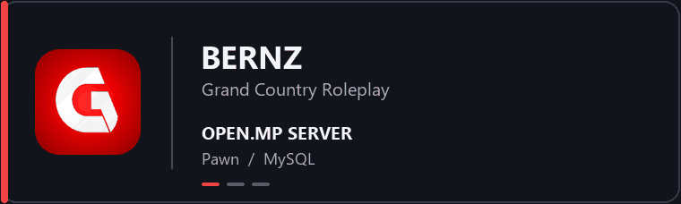

# Hi, I’m Bernz.

Saya mengembangkan Grand Country Roleplay dari sisi server open.mp, client Android, web, dan bot Discord. Pekerjaan saya mencakup sistem gameplay, stabilitas client, serta layanan yang digunakan pemain dan komunitas.

## Yang saya kerjakan

- **Game server:** fitur roleplay dan pemeliharaan gamemode dengan Pawn, open.mp, dan MySQL.
- **Android client:** kontrol, antarmuka, serta investigasi crash dan masalah koneksi dengan Java dan C++.
- **Web & community:** API dan bot komunitas dengan Node.js, Express, dan Discord.js.

## Tech stack

**Languages:** Pawn, JavaScript, Java, C++, SQL, HTML, CSS  
**Platforms & tools:** open.mp, Android SDK/NDK, Node.js, Express, MySQL, Discord.js, Gradle, CMake

Saya juga sedang mengeksplorasi Lua dan FiveM.

## Kontribusi GitHub

<picture>
  <source media="(prefers-color-scheme: dark)" srcset="https://streak-stats.demolab.com?user=inibernz&amp;theme=dark&amp;hide_border=true" />
  
</picture>
